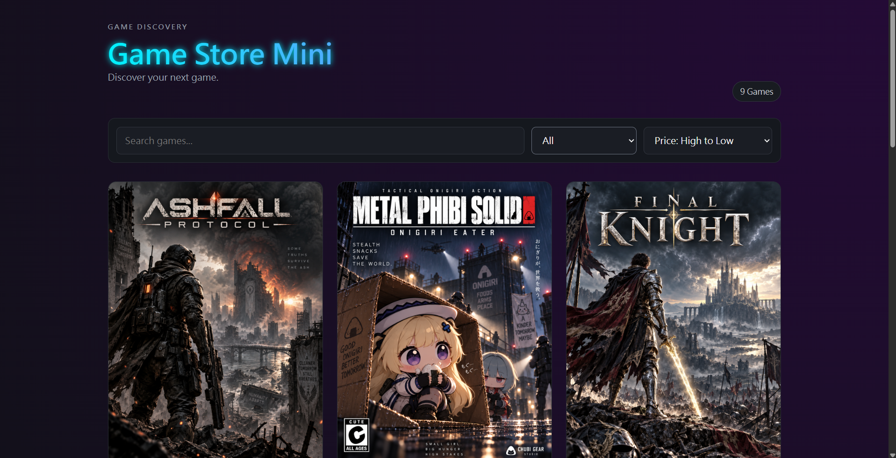

Game Store Mini

React / TypeScript の復習を兼ねて制作した、架空のゲームストア風 Web アプリです。

以前に React や TypeScript を学習したことがありますが、しばらく触れていなかったため、基本的な書き方やデータの流れを思い出す目的で制作しました。

## 画面

## 主な機能
ゲーム一覧表示
タイトル検索
ジャンル絞り込み
価格順・発売日順の並び替え
ゲーム詳細表示
Wishlist への追加・削除
localStorage を使った Wishlist の保存
レスポンシブ対応

## 使用した技術
React
TypeScript
Vite
HTML
CSS
Git / GitHub

制作しながら、主に以下の内容を確認しました。

Component / Props
useState / useEffect
Event Handler
Conditional Rendering
map / filter / sort
TypeScript の type、Union Type
localStorage
CSS Grid / Flexbox
Responsive Design

ゲームデータは親 Component 側で管理し、Props を使って GameCard に渡しています。

検索、ジャンル絞り込み、並び替えについては、ゲームデータを条件に応じて絞り込んでから表示しています。

Wishlist は localStorage に保存しているため、ページを再読み込みしても状態が残ります。

## ゲームデータについて

掲載しているゲーム名やゲーム情報は、この作品用に用意した架空のデータです。

カバー画像には AI で生成した画像を使用しています。

## 起動方法
npm install
npm run dev

表示されたローカル URL をブラウザで開いてください。

## 制作した目的

今回の作品では、React / TypeScript の基本をもう一度確認することを目的にしています。

特に、State が変わると画面が更新される流れや、親 Component から子 Component に Props でデータを渡す流れを意識しながら作りました。
